# Задание 1

1. Возьмите из [демонстрации к лекции готовый код](https://github.com/netology-code/ter-homeworks/tree/main/04/demonstration1) для создания с помощью двух вызовов remote-модуля -> двух ВМ, относящихся к разным проектам(marketing и analytics) используйте labels для обозначения принадлежности.  В файле cloud-init.yml необходимо использовать переменную для ssh-ключа вместо хардкода. Передайте ssh-ключ в функцию template_file в блоке vars ={} .
Воспользуйтесь [**примером**](https://grantorchard.com/dynamic-cloudinit-content-with-terraform-file-templates/). Обратите внимание, что ssh-authorized-keys принимает в себя список, а не строку.
3. Добавьте в файл cloud-init.yml установку nginx.
4. Предоставьте скриншот подключения к консоли и вывод команды ```sudo nginx -t```, скриншот консоли ВМ yandex cloud с их метками. Откройте terraform console и предоставьте скриншот содержимого модуля. Пример: > module.marketing_vm


# Создаем или редактируем файл cloud-init.yml:

```
# cloud-init.yml - корневой модуль
#cloud-config
users:
  - name: ubuntu
    groups: sudo
    shell: /bin/bash
    sudo: ['ALL=(ALL) NOPASSWD:ALL']
    ssh_authorized_keys:
      - ${ssh_public_key}

package_update: true
packages:
  - nginx
  - curl

runcmd:
  - systemctl enable nginx
  - systemctl start nginx
```


## добавим в main.tf 
```
  metadata = {
    user-data = templatefile("${path.module}/cloud-init.yml", {
     ssh_public_key = file("~/.ssh/id_ed25519.pub")
    })
```

## заполним variables.tf
```
variable "service_account_key_file" {
  description = "Path to service account key file"
  type        = string
  default     = "~/.authorized_key.json"
}

variable "public_key" {
  description = "Public SSH key for accessing VMs"
  type        = string
  default     = "~/.ssh/id_ed25519.pub"
}
```

terraform apply


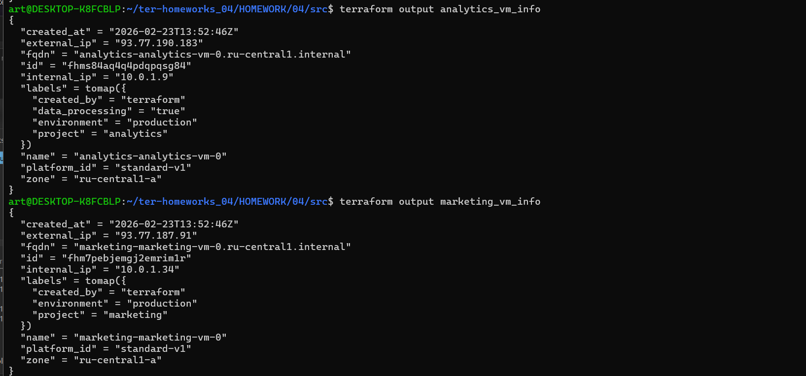


```
ssh ubuntu@93.77.190.183
```


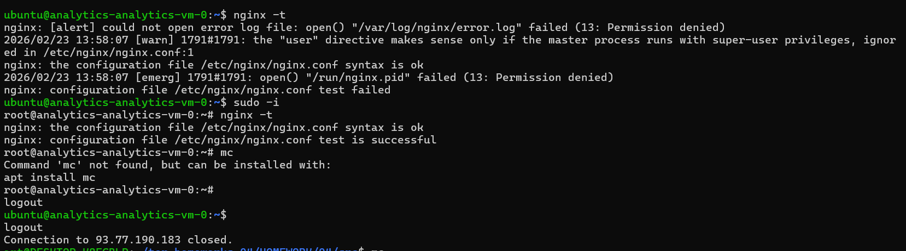


### Задание 2

1. Напишите локальный модуль vpc, который будет создавать 2 ресурса: **одну** сеть и **одну** подсеть в зоне, объявленной при вызове модуля, например: ```ru-central1-a```.
2. Вы должны передать в модуль переменные с названием сети, zone и v4_cidr_blocks.
3. Модуль должен возвращать в root module с помощью output информацию о yandex_vpc_subnet. Пришлите скриншот информации из terraform console о своем модуле. Пример: > module.vpc_dev  
4. Замените ресурсы yandex_vpc_network и yandex_vpc_subnet созданным модулем. Не забудьте передать необходимые параметры сети из модуля vpc в модуль с виртуальной машиной.
5. Сгенерируйте документацию к модулю с помощью terraform-docs.
 
Пример вызова

```
module "vpc_dev" {
  source       = "./vpc"
  env_name     = "develop"
  zone = "ru-central1-a"
  cidr = "10.0.1.0/24"
}
```


## Создадим модуль vpc
```
cd ..04/02/modules
```
Создадим 2 ресурса 

``main.tf``
```
resource "yandex_vpc_network" "this" {
  name = var.network_name != "" ? var.network_name : "${var.env_name}-network"
}
#Условие: var.network_name != "" (проверяем, не пустая ли строка в переменной network_name)
#Если да (True): берем значение из var.network_name
#Если нет (False): создаем имя по шаблону ${var.env_name}-network


resource "yandex_vpc_subnet" "this" {
  name           = "${var.env_name}-subnet"
  zone           = var.zone
  network_id     = yandex_vpc_network.this.id
  v4_cidr_blocks = [var.cidr]
}
```

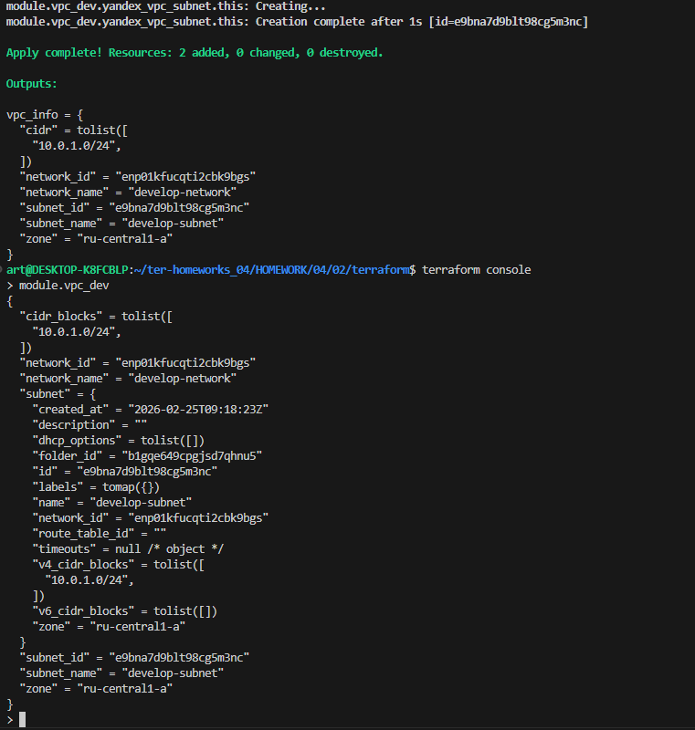

# установим terraform-docs
```
 wget https://github.com/terraform-docs/terraform-docs/releases/download/v0.19.0/terraform-docs-v0.19.0-linux-amd64.tar.gz
 tar -xzf terraform-docs-v0.19.0-linux-amd64.tar.gz
 chmod +x terraform-docs
 sudo mv terraform-docs /usr/local/bin/
 terraform-docs --version
```
## Сгенерируем документацию
```
terraform-docs markdown . > README2.md
```
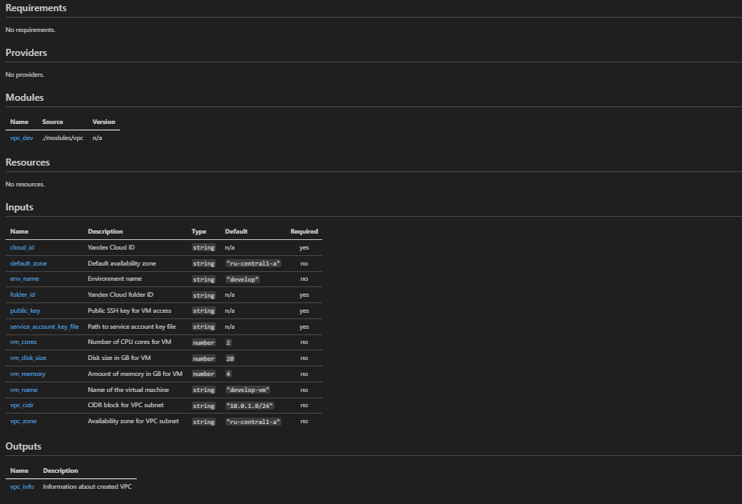


### Задание 3
1. Выведите список ресурсов в стейте.
2. Полностью удалите из стейта модуль vpc.
3. Полностью удалите из стейта модуль vm.
4. Импортируйте всё обратно. Проверьте terraform plan.

Значимых(!!) изменений быть не должно.

### Сначала посмотрим, какие ресурсы сейчас управляются Terraform:

```
# Просмотр всех ресурсов в state
terraform state list
```

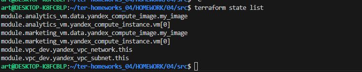

Удалим модуль vpc из state
```
 terraform state rm 'module.vpc_dev'
```
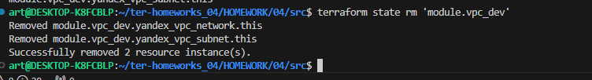
модуль vpc удален
```
terraform state list
```

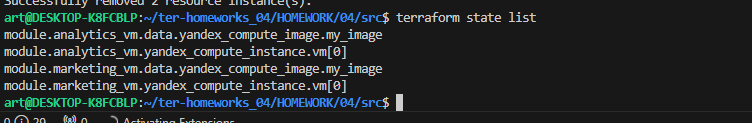

```
# Удаляем marketing_vm
terraform state rm 'module.marketing_vm'

# Удаляем analytics_vm
terraform state rm 'module.analytics_vm'


terraform state list
```
Проверим что  пустой state
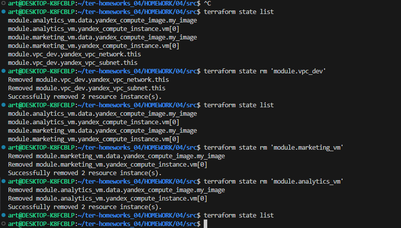

### Импорт ресурсов

Теперь нам нужно импортировать всё обратно. Для импорта нужны ID ресурсов.
Получи ID сети и подсети из модуля vpc_dev:
```
terraform output vpc_info
```
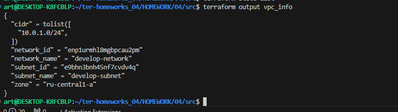


```
# Импорт сети 
terraform import 'module.vpc_dev.yandex_vpc_network.this' enp1urmhl8mgbpcau2pm

# Импорт подсети
terraform import 'module.vpc_dev.yandex_vpc_subnet.this' e9bhn3bnh45nf7cvdv4q
```


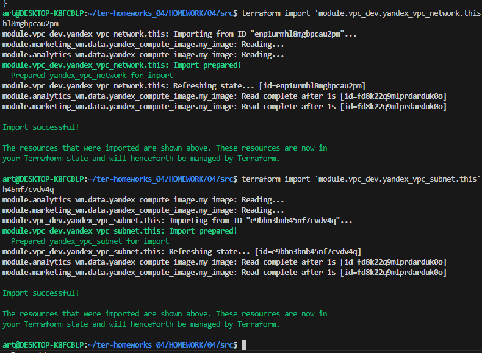


# Задание 4
Измените модуль vpc так, чтобы он мог создать подсети во всех зонах доступности, переданных в переменной типа list(object) при вызове модуля.
Пример вызова
```
module "vpc_prod" {
  source       = "./vpc"
  env_name     = "production"
  subnets = [
    { zone = "ru-central1-a", cidr = "10.0.1.0/24" },
    { zone = "ru-central1-b", cidr = "10.0.2.0/24" },
    { zone = "ru-central1-c", cidr = "10.0.3.0/24" },
  ]
}

module "vpc_dev" {
  source       = "./vpc"
  env_name     = "develop"
  subnets = [
    { zone = "ru-central1-a", cidr = "10.0.1.0/24" },
  ]
}
```


## соддадим дирректорию 
будем работать в ней
```
mkdir -p 04/04_1
```


добавим в main.tf 
```

module "vpc_prod" {
  source   = "./modules/vpc"
  env_name = "production"
  subnets = [
    { zone = "ru-central1-a", cidr = "10.0.1.0/24" },
    { zone = "ru-central1-b", cidr = "10.0.2.0/24" },
    { zone = "ru-central1-d", cidr = "10.0.3.0/24" },  # Исправлено: c, не c
  ]
}

# Для разработки (одна подсеть)
module "vpc_dev" {
  source   = "./modules/vpc"
  env_name = "develop"
  subnets = [
    { zone = "ru-central1-a", cidr = "10.0.1.0/24" },
  ]
}

```
идем в модуль
```
./modules/vpc
```
задаем  проваейдера versions.tf

```

terraform {
  required_providers {
    yandex = {
      source = "yandex-cloud/yandex"
    }
  }
}
```
объявляем переменные сети variables.tf
```
variable "env_name" {
  description = "Name of the environment (e.g., develop, production)"
  type        = string
}

variable "subnets" {
  description = "List of subnets with zones and CIDR blocks"
  type = list(object({
    zone = string
    cidr = string
  }))
}

```

Создаем сети main.tf
```
# Создаем одну сеть
resource "yandex_vpc_network" "this" {
  name = "${var.env_name}-network"
}

# Создаем подсети динамически, по количеству элементов в var.subnets
resource "yandex_vpc_subnet" "this" {
  count = length(var.subnets)

  name           = "${var.env_name}-subnet-${var.subnets[count.index].zone}"
  zone           = var.subnets[count.index].zone
  network_id     = yandex_vpc_network.this.id
  v4_cidr_blocks = [var.subnets[count.index].cidr]
}
```

забираем outputs.tf

```
output "network_id" {
  description = "ID of the created VPC network"
  value       = yandex_vpc_network.this.id
}

output "subnet_ids" {
  description = "List of IDs of created subnets"
  value       = yandex_vpc_subnet.this[*].id
}

# Для обратной совместимости, если нужен ID первой подсети
output "subnet_id" {
  description = "ID of the first subnet (for backward compatibility)"
  value       = try(yandex_vpc_subnet.this[0].id, null)
}
```

в основном модуле main.tf создаем  сети для  соответствующих VM

```
module "vpc_prod" {
  source   = "./modules/vpc"
  env_name = "production"
  subnets = [
    { zone = "ru-central1-a", cidr = "10.0.1.0/24" },
    { zone = "ru-central1-b", cidr = "10.0.2.0/24" },
    { zone = "ru-central1-d", cidr = "10.0.3.0/24" },  
  ]
}

# Для разработки (одна подсеть)
module "vpc_dev" {
  source   = "./modules/vpc"
  env_name = "develop"
  subnets = [
    { zone = "ru-central1-a", cidr = "10.0.1.0/24" },
  ]
}

```

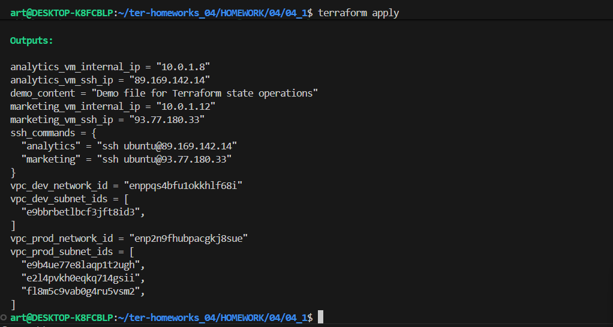